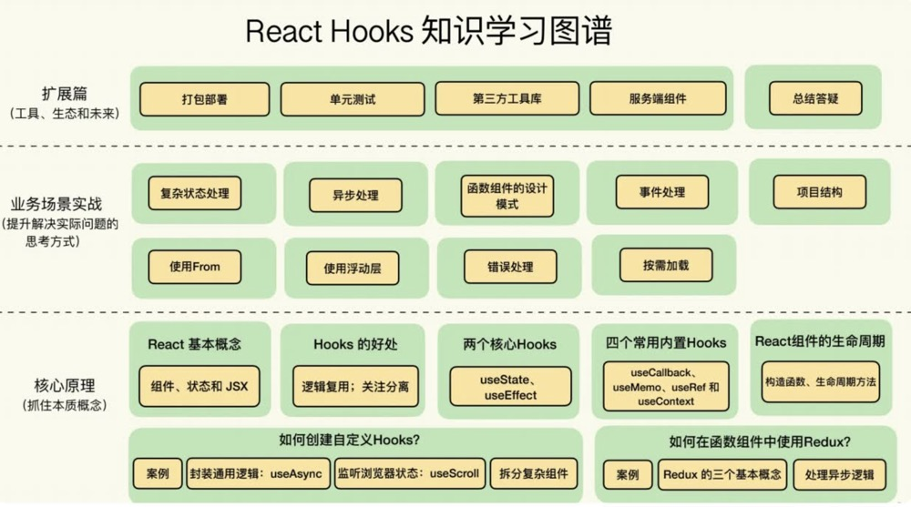

<!--
 * @Author: your name
 * @Date: 2022-01-04 22:51:36
 * @LastEditTime: 2022-01-18 19:54:01
 * @LastEditors: Please set LastEditors
 * @Description: 打开koroFileHeader查看配置 进行设置: https://github.com/OBKoro1/koro1FileHeader/wiki/%E9%85%8D%E7%BD%AE
 * @FilePath: /blog/front-end/React Hooks原理剖析.md
-->

# React Hooks 原理剖析

> React 拥有两个非常颠覆式的创新，一个是虚拟 DOM， 一个是 JSX

在 `Hooks` 出现之前，业务逻辑的重用可以说是 `React` 开发的一大痛点和难点。比如，你需要在组件中去监听窗口大小的变化，以便在布局上做调整。那么我们就得在类组件的不同生命周期中做事件监听的绑定和解绑。

引入 `Hooks` 的概念之后，函数组件就具备了状态管理、生命周期管理等能力，几乎可以实现原来的 `Class` 组件具有的所有能力。 函数组件结合 `Hooks` 带来的简洁的写法，以及直观的逻辑重用能力，让函数组件成为了 `React` 中的一等公民。

从 `Class` 组件到函数组件的转变，不仅仅是一个写法的区别，更是整个开发思路的转变。而我们只有学会用 `Hooks` 的角度去思考问题



## 创建 React 应用

`React` 的中文含义是“反应”或“响应”，它描述了 `React` 这样一个前端框架的核心原理：当数据发生变化时，`UI` 能够自动把变化反映出来。

### 理解 React 的基本概念

`React` 其实就是 组件、状态和 `JSX`。

#### 使用组件的方式描述 UI

在 `React` 中，所有的 `UI` 都是通过组件去描述和组织的。可以认为，`React` 中所有的元素都是组件

```jsx
function CommentBox() {
  return (
    <div>
      <CommentHeader />
      <CommentList />
      <CommentForm />
    </div>
  );
}
```

#### 使用 state 和 props 管理状态

在函数组件中，我们可以使用 `useState` 这样一个 `Hook` 来保存状态，那么状态在发生变化时，也会让 `UI` 自动发生变化。

```jsx
import React from "react";

export default function Counter() {
  const [count, setCount] = useState(0);
  return (
    <div>
      <button onClick={() => setCount(count + 1)}>{count}</button>
    </div>
  );
}
```

而组件之间的交互，就由 `props` 来完成.

```jsx
import React from "react";

function CountLabel({ count }) {
  // 子组件用于显示颜色
  const color = count > 10 ? "red" : "blue";
  return <span style={{ color }}>{count}</span>;
}

export default function Counter() {
  // 定义了 count 这个 state
  const [count, setCount] = useState(0);
  return (
    <div>
      <button onClick={() => setCount(count + 1)}>
        <CountLabel count={count} />
      </button>
    </div>
  );
}
```

`JSX` 并不是一个新的模板语言，而可以认为是一个语法糖

```js
React.createElement(
  "div",
  null,
  React.createElement(
    "button",
    {
      onClick: function onClick() {
        return setCount(count + 1);
      },
    },
    React.createElement(CountLabel, { count: count })
  )
);
```

`JSX` 的部分我们是用 `JavaScript` 的方式去实现的，并且用到了 `React.createElement` 这样一个 API，它的作用就是创建一个组件的实例。

#### 实战：创建一个能发送请求的组件

```jsx
import React, { useState, useEffect } from "react";

export default function UserList() {
  // 使用三个 state 分别保存用户列表， loading 状态和错误状态
  const [users, setUsers] = useState([]);
  const [loading, setLoading] = useState(false);
  const [error, setError] = useState(null);

  // 定义获取用户的回调函数
  const fetchUsers = async () => {
    setLoading(true);
    try {
      const res = await fetch("https://reqres.in/api/users/");
      const json = await res.json();
      // 请求成功后将用户数据放入 state
      setUsers(json.data);
    } catch (err) {
      // 请求失败将错误状态放入 state
      setError(err);
    }
    setLoading(false);
  };

  return (
    <div className="user-list">
      <button onClick={fetchUsers} disabled={loading}>
        {loading ? "Loading..." : "Show Users"}
      </button>
      {error && <div stle={{ color: "red" }}>Failed: {String(error)}</div>}
      <br />
      <ul>
        {users.length > 0 &&
          users.map((user) => {
            return <li key={user.id}>{user.first_name}</li>;
          })}
      </ul>
    </div>
  );
}
```

## 为什么会有 Hooks ?

思考 `React`组件的本质, `React` 组件的模型其实很直观，就是从 `Model` 到 `View` 的映射，这里的 `Model` 对应到 `React` 中就是 `state` 和 `props`

顾名思义，`Hook` 就是“钩子”的意思。在 `React` 中，`Hooks` 就是把某个目标结果钩到某个可能会变化的数据源或者事件源上，那么当被钩到的数据或事件发生变化时，产生这个目标结果的代码会重新执行，产生更新后的结果

对于函数组件，这个结果是最终的 `DOM` 树；对于 `useCallback`、`useMemo` 这样与缓存相关的组件，则是在依赖项发生变化时去更新缓存

我们的初衷是为了实现 `UI` 组件的渲染，那么在 `React` 中，其实所有的 `Hooks`的最终结果都是导致 `UI` 的变化。

`Hooks` 中被钩的对象，不仅可以是某个独立的数据源，也可以是另一个 `Hook` 执行的结果，这就带来了 `Hooks` 的最大好处：逻辑的复用

让我们来看看调整浏览器窗口重新布局这样一个需求，在 `class` 类组件中如何实现, 首先我们不可能实现两个组件来满足需求，所以，我们必须使用 `HOC`（高阶组件）来完成

```js
const withWindowSize = (Component) => {
  // 产生一个高阶组件 WrapperdComponent ，只包含监听窗口大小逻辑
  class WrappedComponent extends React.PureComponent {
    constructor(props) {
      super(props);
      this.state = {
        size: this.getSize(),
      };
    }

    componentDidMount() {
      window.addEventListener("resize", this.handleResize);
    }

    componnetWillUnmount() {
      window.removeEventListener("resize", this.handleResize);
    }

    getSize() {
      return window.innerWidth > 1000 ? "large" : "small";
    }

    handleResize = () => {
      const currentSize = this.getSize();
      this.setState({
        size: this.getSize(),
      });
    };

    render() {
      // 将窗口大小传递给真正的业务逻辑组件
      return <Component size={this.state.size} />;
    }
  }

  return WrappedComponent;
};
```

接下来，包装我们的业务组件

```jsx
class MyComponent extends React.PureComponent {
  render() {
    const { size } = this.props;
    if (size === "small") return <SmallComponent />;
    else return <LargeCoponent />;
  }
}

export default withWindowSize(MyComponent);
```

高阶组件几乎是 `Class` 组件中实现代码逻辑复用的唯一方式，其缺点其实比较显然：

- 代码难理解，不直观，很多人甚至宁愿重复代码，也不愿用高阶组件；
- 会增加很多额外的组件节点。每一个高阶组件都会多一层节点，这就会给调试带来很大的负担。

然后我们再来使用 `Hooks` 实现这个需求

```js
cons getSize = () => {
  return window.innerWindow > 1000 ? "large" : "small"
}

const useWindowSize = () => {
  const [size, setSize] = seState(getSize())

  useEffect(() => {
    const handler = () => setSize(getSize())
    window.addEventListener("resize", handler)
    return () => {
      window.removeEventListener("resize", handler)
    }
  }, [])

  return size
}
```

## 关注分离

关注分离的意思是说 `Hooks` 能够让针对同一个业务逻辑的代码尽可能聚合在一块儿。这是过去在 `Class` 组件中很难做到的。因为在 `Class` 组件中，你不得不把同一个业务逻辑的代码分散在类组件的不同生命周期的方法中。所以通过 `Hooks` 的方式，把业务逻辑清晰地隔离开，能够让代码更加容易理解和维护。

## 组件状态和生命周期

`React` 提供的 `Hooks` 其实非常少，一共只有 `10` 个，比如 `useState`、`useEffect`、`useCallback`、`useMemo`、`useRef`、`useContext`

### useState

`useState` 这个 `Hook` 用来管理 `state`, 它可以让函数组件具有维持状态的能力。在一个
函数组件的多次渲染之间，这个 `state` 是共享的。

```jsx
import React, { useState } from "react";

function Example() {
  // 创建一个保存 count 的 state， 并给初始值 0
  const [count, setCount] = useState(0);

  return (
    <div>
      <p>{count}</p>
      <button onClick={() => setCount(count + 1)}> + </button>
    </div>
  );
}
```

- `useState(initialState)` 的参数 `initialState` 是创建 `state` 的初始值，它可以是任意类型。
- `useState()` 的返回值是一个有着两个元素的数组。第一个数组元素用来读取 `state` 的值，第二个则是用来设置这个 `state` 的值。在这里要注意的是，`state` 的变量（例子中的 `count`）是只读的，所以我们必须通过第二个数组元素 `setCount` 来设置它的值。

通常来说，我们要遵循的一个原则就是： `state` 中永远不要保存可以通过计算得到的值。比如说：

- 从 `props` 传递过来的值。
- 从 `URL` 中读到的值。
- 从 `cookie`、`localStorage` 中读取的值。

### useEffect

`useEffect` 用于执行一段副作用。副作用是指一段和当前执行结果无关的代码。比如说要修改函数外部的某个变量，要发起一个请求，等等。也就是说，在函数组件的当次执行过程中，`useEffect` 中代码的执行是不影响渲染出来的 `UI` 的。

useEffect 可以接收两个参数，函数签名如下：

```js
useEffect(callback, dependencies);
```

第一个为要执行的函数 `callback`，第二个是可选的依赖项数组 `dependencies`。其中依赖项是可选的，如果不指定，那么 `callback` 就会在每次函数组件执行完后都执行；如果指定了，那么只有依赖项中的值发生变化的时候，它才会执行。

> `useEffect` 是每次组件 `render` 完后判断依赖并执行

```jsx
import React, { useState, useEffect } from "react";

function BlogView({ id }) {
  // 设置一个本地 state 用于保存 blog 内容
  const [blogContent, setBlogContent] = useState(null);

  useEffect(() => {
    // useEffect 的 callback 要避免直接的 async 函数，需要封装一下
    const doAsync = async () => {
      // 当 id 发生变化时，将当前内容清除以保持一致性
      setBlogContent(null);
      // 发起请求获取数据
      const res = await fetch(`/blog-content/${id}`);
      // 将数据存入 state
      setBlogContent(await res.text());
    };
    doAsync();
  }, [id]); // 使用 id 作为依赖项，变化时则执行副作用

  // 如果没有 blogContent 则认为是在 loading 状态
  const isLoading = !blogContent;
  return <div>{isLoading ? "Loading..." : blogContent}</div>;
}
```

`useEffect` 还有两个特殊的用法：没有依赖项，以及依赖项作为空数组

- 没有依赖项，则每次 `render` 后都会重新执行。
- 空数组作为依赖项，则只在首次执行时触发

```jsx
useEffect(() => {
  // 组件首次渲染时执行，等价于 class 组件中的componentDidMount
  console.log("did mount");
}, []);
```

`useEffect` 还允许你返回一个函数，用于在组件销毁的时候做一些清理的操作。比如移除事件的监听。

```jsx
const [size, setSize] = useState({});

useEffect(() => {
  const handler = () => {
    setSize(getSize());
  };
  window.addEventListener("resize", handler);

  // 返回一个 callback 在组件销毁时调用
  return () => {
    // 移除 resize 事件
    window.removeEventListener("resize", handler);
  };
}, []);
```
